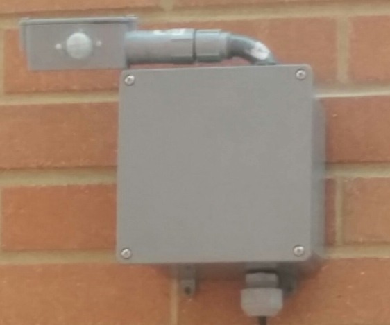
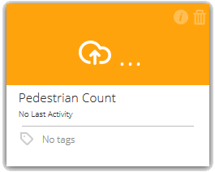
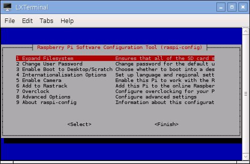
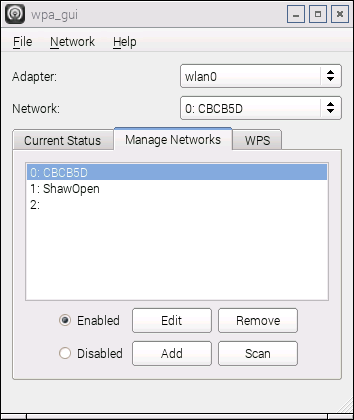

(18/01/2016) NOTE: I am currently in the middle of a serious refactor of the project in order to clean up and to later be able to easily add support for backends other than Ubidots.

Raspberry Pi 2 Pedestrian Counter
=================================

Contents:
---------
- 1.) About
- 2.) What is needed
    - 2.1) Hardware
        - 2.1.1) Power Supply
        - 2.1.2) Housing 
    - 2.2) Software
- 3.) Software Setup
    - 3.1) Update the Raspbian OS
    - 3.2) Install the needed python libraries
    - 3.3) Setup the Pi to automatically start the counter on boot before login
    - 3.4) Setup Ubidots account
        - 3.4.5) Add account info to the counter's UbidotsAccountInfo.xml
    - 3.5) (Optional) Setup a script to get the Pi to reconnect to the network if it loses connection
    - 3.6) (Optional) Enable SSH on the Pi
    - 3.7) (Optional) Install a VNC Server on the Pi and have it boot on startup
    - 3.8) (Optional) Install Weaved on Pi and set up an account
    - 3.9) (Optional) Configure the Pi to automatically connect to a specified network
- 4.) The Code
    - 4.1) Easily configuring the program
- 5.) Future
- 6.) Other Notes

1.) About
---------
The City of Edmonton (Alberta, Canada) was looking for an inexpensive solution for producing pedestrian counters that could be placed around the city to provide a real time count of pedestrian traffic in specific areas. This project was a prototype and therefore was very simple. The main hardware (full list below) consisted of a Pi 2, USB Wifi dongle and a PIR sensor.

The device functions very simply. Whenever the sensor detects infrared movement, it increments a counter and logs the date and time to a file. When certain conditions are met (enough detections, time passed), the counter attempts to update the count stored on an Ubidots server. This is where the "real time" comes from, since you can monitor the current detections from another device.

2.) What is needed
------------------
#### 2.1) Hardware ####
The hardware used for the counter was pretty minimal. In reality using a Pi for this setup might be overkill, but being someone who doesn't have very much experience with working with hardware, the Pi was nice since some things like connecting to WiFi was easy(ish) and being able to remote connect to the device was a very nice feature to have. However, if the goal was to create a counter that did not need to rely on being plugged into an outlet (solar, battery), then the Pi has a very major drawback in the amount of power it consumes. When idle, the [Pi 2 consumes 230 mA](http://raspi.tv/2015/raspberry-pi2-power-and-performance-measurement) (When running the pedestrian counter script, I think you can consider the Pi to be idle). For us in Edmonton, we're currently looking at building another pedestrian counter using something other than a Pi that would have a very low power consumption and could sustain itself with solar energy.

What we used to build the pedestrian counter:
- Raspberry Pi 2
- WiFi USB dongle
- PIR motion sensor
- 3 female to female wires
- 5V power supply
    - Had to splice a micro USB cable with the power supply output cord
- Electronics housing bought at Home Depo
- Extension cord plugged into wall

We initially followed [this guide](http://blog.ubidots.com/building-a-people-counter-with-raspberry-pi-and-ubidots) when the project was first started. For the hardware, everything remained the same except we:
- removed the battery and replaced it with a power supply plugged into an outlet
- changed the housing so it's waterproof and the sensor can rotate on two axis’s

Also note that the guide uses a Pi Model B while we used a Pi 2. The B+ and Pi 2 have 40 pins instead of 26, so don't go by the pin layout in the guide if you use it!

I've included a diagram of the GPIO pin layout for the Pi 2 and B+ below:

#### 2.1.2) Housing ####

For the housing, it was important to be able rotate the sensor on two axis in order to be able to configure its field of view (FOV) after installation. The arm in the picture can be rotated vertically and the head where the sensor sits rotates horizontally. I also used two pieces of electrical tape to reduce the FOV of the sensor to a narrow vertical slit (after image was taken) since the FOV is very large without it and could therefore detect one pedestrian multiple times.

#### 2.2) Software ####
Software used:

- Python 2.7 (Pre-installed on Pi)
    - Libraries used:
        - GPIO (Built in)
        - Ubidots
- Weaved (optional, but nice)
- Tight VNC
- Some small shell scripts

3.)  Software Setup
-------------------
Assuming that you are starting with a fresh Raspberry Pi with the Raspbian OS, this is what you will need to do:

- Update the Raspbian OS

- Install the needed python libraries

- Setup the Pi to automatically start the counter on boot before login

- Setup Ubidots account (Currently not optional)

- Add account info to the counter's UbidotsAccountInfo.xml

- (Optional) Setup a script to get the Pi to reconnect to the network if it loses connection

- (Optional) Enable SSH on the Pi

- (Optional) Install a VNC Server on the Pi and have it boot on startup

- (Optional) Install Weaved on Pi and set up an account (Only if the counter is not going to be on a network that you can control)

- (Optional) Configure the Pi to automatically connect to a specified network (Only if you are unable to connect a display, keyboard and mouse while the Pi is set up in the WiFi area that you want it to operate in (Likely))

#### 3.1) - Updating the Pi ####
Before you do anything, make sure the Raspbian OS is up to date.
To do this, open a terminal and type:
    - *sudo apt-get update*
    - *sudo apt-get upgrade*

#### 3.2) - Installing the Python libraries ####
Now you need to install the third party libraries that the pedestrian counter needs.
Again, in terminal type:
    - *sudo aptitude install python-setuptools*
    - *sudo easy_install pip* (Used to easily install python libraries)
        
To install the actual libraries:
    - *sudo pip install ubidots* (NOTE: sudo might not be needed)
    
#### 3.3) - Setup the Pi to automatically start the counter on boot before login ####
Technically this is optional, but unless you want to manually start up the counter script by either remote connecting to the Pi or connecting a display, mouse and keyboard (shutter), then this step is important.

I ended up using a Daemon (a process that starts on boot up and runs until the Pi is shut down) to start the script automatically.

I followed this [very helpful guide](http://blog.scphillips.com/posts/2013/07/getting-a-python-script-to-run-in-the-background-as-a-service-on-boot/) to set up the Daemon. I've included my modified version of the init shell under Needed_Scripts/Start_Pedestrian_Counter. If you use my modified version, you just need to take a look at the **Using the init script** section. Also you probably will need to change the **DIR** variable in the script to match the location of your cloned repository.

#### 3.4) - Setup an Ubidots account ####

You need to set up a free account with Ubidots to use their service. [LINK](http://ubidots.com/)

Once you have an account and are logged in, you need to go to the sources tab (top right) and add a new data source. You can call it whatever you want. Next click on your newly created data source and then add a new variable. Again call it what you want and keep the type set to *Normal*.

After that, click on the little information circle and note the **Variable ID** that pops up as you will need it later to connect the program to your account. You're also going to need to get your account key for the same reason. To get it, you need to go into your account settings which is in the top left corner under "your account name" --> My Profile and then click on API Keys on the right. Record your API key.

#### 3.4.5) - Add account info to the counter's UbidotsAccountInfo.xml ####
Now that you have your variable and API key, we need to add these to an xml file in the program's Data directory.

However, the Data directory and it's xml file won't exist until you run the program at least once. Let's do that now.

Open a terminal and navigate to the repo's directory. To run the program type **sudo python Mainer.py**. Note that **sudo is needed** because Mainer uses the GPIO library which requires sudo. The program should crash and attempt to restart due to the xml file not having the keys. Exit the program with cntl-c and navigate and open the new XML file in the Data directory. In it you should see empty attributes for the two keys (AccountKey= and PedestrianCountKey=). Fill in your keys and you're good to go!
    
#### 3.5) - (Optional) Setup a script to get the Pi to reconnect to the network if it loses connection ####
I ran into an odd problem when using the Raspbian's default WiFi connection tools (WPA_Supplicant) where if the wireless connection that the Pi was currently on drops out for any reason but then comes back, the Pi will not automatically reconnect. To solve this, I found (and modified) a simple 'hacky' shell script that checks if the Pi is currently connected to a network and if not, it forces the Pi to try to reconnect to any network that is available that it recognizes.

The script I used is **WiFi_Auto_Reconnect.sh** and is found under **Needed_Scripts** in the repo. I used a built in service called crontab that can be used to run a script at any interval. It's very easy to set up. You just need to add a new entry to the crontab file which just states what script to run and how often.

To edit the crontab file, go into a terminal and type **crontab -e** to bring up the file for editing. Go down to the very bottom of the file and add the cron entry found below:

    /30 * * * * PATH_TO_SCRIPT_HERE

Where *PATH_TO_SCRIPT_HERE* is the path to the WiFi_Auto_Reconnect.sh. I'm not going to go into details of how the crontab syntax works (it's simple), but if you want to learn more, do a quick Google search or [check out this link](http://www.adminschoice.com/crontab-quick-reference). The crontab entry we just added runs the script every 30 minutes (even before login).

#### 3.6) - (Optional) Enable ssh on the Pi ####
This one is easy. If you want to be able to ssh to the Pi, you need to only enable one setting in raspi-config.

howToGeek has a quick guide which also includes how to connect to your Pi from a Windows machine using PuTTY (since Windows doesn't support ssh natively). Just read everything until **Setting Up and Configuring Your Remote Desktop**. [LINK](http://www.howtogeek.com/141157/how-to-configure-your-raspberry-pi-for-remote-shell-desktop-and-file-transfer/all/)

#### 3.7) - (Optional) Install a VNC Server on the Pi and have it boot on startup ####
One downside of ssh'ing to the Pi is that you are forced to use a terminal. This isn't necessarily a bad thing if you are a terminal guy, but for people who like interacting through a GUI to work on a computer (like me!), it might really slow you down or just plain stop you from doing anything if you are unfamiliar with using terminal.

There is a solution though, and it's to use a VNC server and client, where the server sends the screen data (pixels) to the client and the client sends the user input (keyboard and mouse) to the server.

I used TightVNC, which is a free open source VNC implementation. Others should work as well as long as the server can run on Linux.

The same guide used above for setting up ssh also goes over how to set up TightVNC: [LINK](http://www.howtogeek.com/141157/how-to-configure-your-raspberry-pi-for-remote-shell-desktop-and-file-transfer/all). Just follow the part under **Setting Up and Configuring Your Remote Desktop**. Note that this guide also configures the VNC to boot on startup through a Daemon. If you want, you can also do **Setting Up and Configuring File Transfer Tools** to set up FileZilla to transfer files between your Pi and your machine.

One thing to note: Connecting directly through TightVNC is not secure as the data is not encrypted, which means that someone could intercept the data and view your session or possibly something worse. It is generally not recommended to use only an unsecured VNC connection when connecting to another machine over the internet. Instead, you can have the VPN connect to the device through a ssh tunnel (see above) or use a VPN service that encrypts it's whole connection (UltraVPN I hear does this), or connect through a VPN. Again, if the device you are VNC'ing to is on the same network and you trust that the network is secure (like your home network), then you probably don't have to worry about this. Finally note that Weaved does it's own encryption on it's traffic, so you could just rely on their encryption as well.

I haven't done this since I'm using Weaved, but doing a quick Google search brings up a bunch of tutorials of how to do this on different operating systems. Note that on Windows you would need to use a program like PuTTY to ssh.

#### 3.8) - (Optional) Install Weaved and set up an account ####

Note: You only need to do this if the counter is not going to be on a network that does not have any forwarded (open) ports.

When you try to make a connection to a VNC server from a VNC client and both are on separate networks, the network that hosts the VNC server must have at least one port open and the VNC server must listen for any connections coming in on that port. Note also that closing a port on a network only blocks **incoming connections**, **not outgoing connections**. In some cases (my case), the network that the VNC server is on has no open ports.

So if the network hosting your VNC server has no open ports, how do you establish a connection between the VNC server and client? Well, since a closed network port only blocks incoming connections and not outgoing, we are free to make any outgoing connection from inside the network. In theory, we could establish a connection by having the VNC server connect to the client (client in listen mode), but then we have no way to make the VNC server initiate the connection (besides on a timer or something). The solution, an intermediate server to bridge the connections (AKA a reverse ssh tunnel)

A quick easy way to get this done is to use Weaved (open source), which acts as the intermediate server. While you can pay for the service, there is currently a free version of the service which is perfect for what we need.

First you are going to have to make an account with Weaved. [LINK](http://www.weaved.com/)

Then you are going to need to install the Weaved client on the Pi: [LINK](https://developer.weaved.com/portal/members/betapi.php)
- If you are planning on using both SSH and VNC, you will need to run the installer twice. Just make sure to make each one's "device name" is slightly different.

And finally, test your connection to make sure you can connect through Weaved.

#### 3.9) (Optional) - Configure the Pi to automatically connect to a specified network ####
This step is needed if the Pi is going to be running in an area on a network where you won't be able to bring a display, keyboard and mouse to manually connect the Pi to the network (select the network, enter password, etc.) at least once.

If this is the case, then you will need to pre-configure a config file used by wpa_supplicant. There are two ways to do this; you can either go through wpa_gui or you can edit the config file itself. Going through the GUI is the easiest, but if you manually edit the config file you can be sure it's set up as you want (You can always check the config file after going through the GUI). For this guide, I'm just going to cover the GUI method.

##### GUI Method ####
- Open the Pi's start menu, go to *Run...* and then enter *wpa_gui*
- Go to the Manage Networks tab and click the *Add* button to add a new network.
- Enter the information necessary and click *Add*.
 

 
 Note that:
 - If you want to connect to an open network, set authentication to *"Plaintext"*
 - If you want to connect to any open network, make sure SSID is blank (for config *ssid=""*) and authentication is plaintext.
    - You should also give this the lowest priority of any networks in your list.

If you want to edit it manually, here are a few links to help:

- [Simple](https://learn.sparkfun.com/tutorials/using-pcduinos-wifi-dongle-with-the-pi/edit-wpasupplicantconf)
- [In-Depth](http://manpages.ubuntu.com/manpages/hardy/man5/wpa_supplicant.conf.5.html)

4.) The Code
------------
The code I wrote may not be the prettiest, but to be fair this was my first Python program. There are very likely things that go against the "Python way" or are maybe just weird or messy. Regardless, any suggestions/feedback is totally welcome. :)

The code is a bit messy ATM, but hopefully in the next while when I have some I can clean it up a bit.

#### 4.1) Easily configuring the program ####
I grouped a whole bunch of useful constants in one place for easy configuration. There are three that are particularly useful. They are:
- *const_MotionPin* - The GPIO pin number that the program will listen for feedback from the PIR sensor (See layout map below)
- *const_UpdateServerPedestrianInterval* - Every nth detections (where nth is this variable) an attempt to update the Ubidots detection counter will be made
- *const_UpdateUbidotsTimeInterval* - (NOT IMPLEMTED YET) If at least this amount of time has passed since connecting to Ubidots when a detection is made, then an attempt to update the Ubidots detection counter will be made.

5.) Features I would like to add
--------------------------------
- It would be nice to not be so dependent on Ubidots and be flexible with other services out there. (Or work without one)

6.) Other Notes
---------------
- I would have liked to have used Python 3, but the Ubidots Python library only works with 2.7.
- If you are going to use this for serious pedestrian counting and especially if you want to have real-time updates, Ubidots might not be the best option. The free account gives you 30 000 "dots", (variable updates) which is fine if you're updating infrequently or want to just use this as more of a fun project, but can get quite limiting/expensive. An alternative solution would be to set up a simple server program that just listens for the counter's updates and then updates a local database/CSV file. This way you don't have to worry about how often you are sending updates. The downside is that going this route will likely take a lot more time and might be costly - if you can't do it yourself.
- Depending on your WiFi dongle, you may run into an issue when ssh’ing where you will lose connection after some time of inactivity (15 sec?). In my case, this was caused by the USB going into a power saving mode after some time of inactivity. I did what's under the **Power management issue** heading [in this guide](https://www.andreagrandi.it/2014/09/02/how-to-configure-edimax-ew-7811un-wifi-dongle-on-raspbian/) (minus the additional crontab script).
- I'm currently having an issue where sometimes the Pi fails to connect to the network even after giving it enough time to run the crontab to reconnect. I'm not really sure what the cause of this is. I've tested the crontab reconnect script and it seemed to reconnect fine after the local network was rebooted.
- There is some disabled (commented out) code in Mainer.py for determining its network's external IP and uploading it to Ubidots as an integer. This could be useful for someone who has the counter on a network with open ports since the network's IP could change and you could always get the correct IP to connect to. I haven't tested this so I don't know if it actually converts the IP to an integer correctly and I don't know how useful this would actually be.

#### Some potentially useful tips if you're new to Linux: ####
- There's one handy WiFi connection tool that seems to get removed from the start menu once you update Raspbian called wpa_gui. It's still there however, and to access it you can go to "run" in the start menu and type its name ("wpa_gui"). Using this tool really simplifies connecting to wireless networks.
- When running a program from terminal, you can stop it from running with **cntl-c**.
